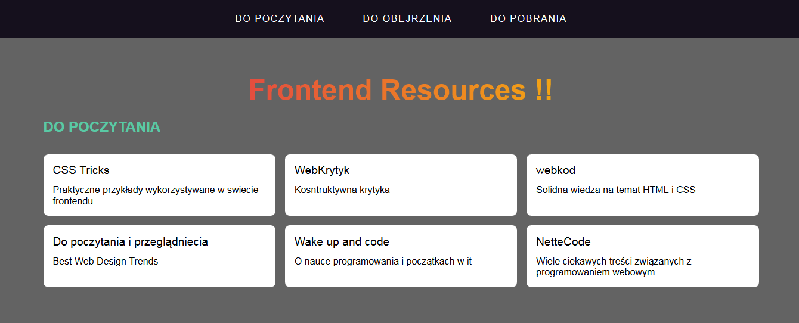

# Frontend Resources - WTF Course

live: https://piotrn-87.github.io/frontend-tools__Resources/

to run locally -> 

`npm install -g gulp-cli`

`npm install`

`gulp`

To publish your page using github pages use `npm run deploy`
